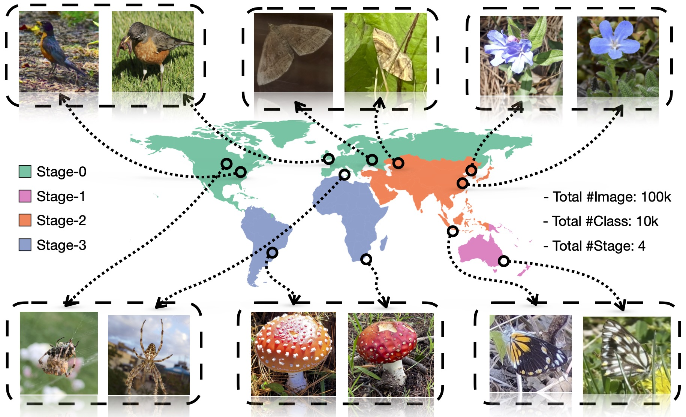

# Incremental Generalized Category Discovery

This repo contains code for our paper: [Incremental Generalized Category Discovery](https://arxiv.org/abs/2304.14310).



We explore the problem of Incremental Generalized Category Discovery (IGCD). This is a challenging category incremental learning setting where the goal is to develop models that can correctly categorize images from previously seen categories, in addition to discovering novel ones. Learning is performed over a series of time steps where the model obtains new labeled and unlabeled data, and discards old data, at each iteration. The difficulty of the problem is compounded in our generalized setting as the unlabeled data can contain images from categories that may or may not have been observed before. We present a new method for IGCD which combines non-parametric categorization with efficient image sampling to mitigate catastrophic forgetting. To quantify performance, we propose a new benchmark dataset named iNatIGCD that is motivated by a real-world fine-grained visual categorization task. In our experiments we outperform existing related methods

## Running

### Dependencies

```
pip install -r requirements.txt
```

### Config

Set paths to datasets and desired log directories in ```config.py```


### Dataset

The dataset -- iNatIGCD, can be downloaded from [huggingface](https://huggingface.co/datasets/tennant/iNatIGCD).


### Scripts

**Train the model**:

```
bash scripts/run.sh
```

## Citing this work

If you find this repo useful for your research, please consider citing our paper:

```
@inproceedings{zhao2023incremental,
  title={Incremental generalized category discovery},
  author={Zhao, Bingchen and Mac Aodha, Oisin},
  booktitle={ICCV},
  year={2023}
}
```

## Acknowledgements

The codebase is largely built on this repo: https://github.com/CVMI-Lab/SimGCD.


## License

This project is licensed under the MIT License - see the [LICENSE](LICENSE) file for details.
